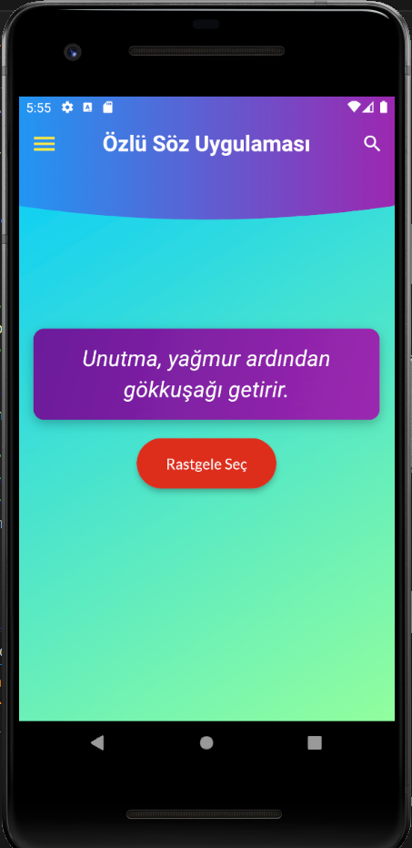
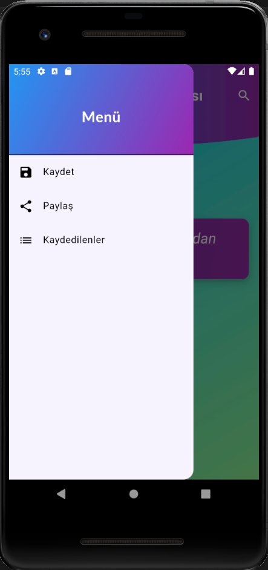
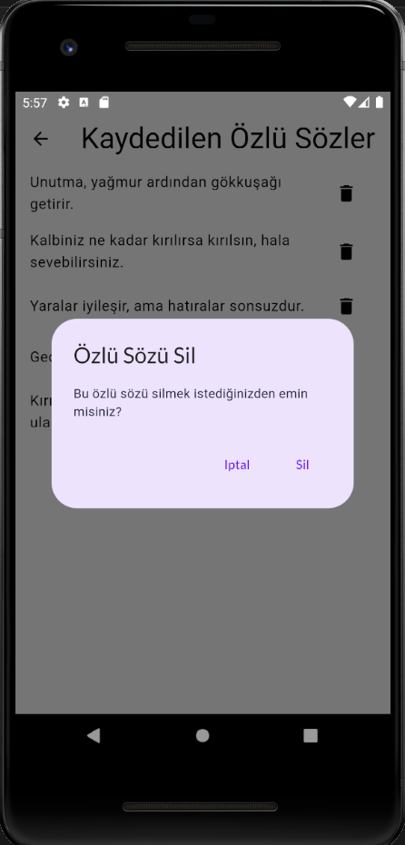

# Özlü Söz Uygulaması

Bu uygulama, kullanıcıların özlü sözleri görmelerini ve favori sözlerini kaydetmelerini sağlayan bir Flutter uygulamasıdır.

## Özellikler

- Özlü sözleri listeleme
- Favori sözleri kaydetme ve görüntüleme
- Kaydedilen sözleri silme
- Sözleri paylaşma özelliği

## Ekran Görüntüleri






## Kurulum

Projeyi yerel ortamınıza kurmak için şu adımları izleyin:

1. Bu repo'yu klonlayın:

```bash
git clone https://github.com/SevalSorak/quotation_app.git  

